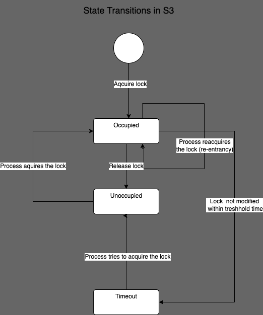
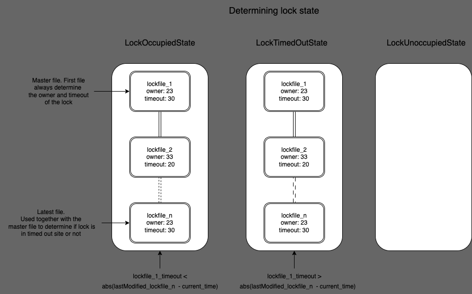

# Development of distributed looking mechanism using S3

# 1. Understanding the problem and tools

## File looks in Linux

In order to get an overview, and some inspiration on how to implement a file locking mechanism in S3, the problem instructions suggested looking into how traditional file locking mechanisms work. Since I’m most familiar with Linux, I used it for reference. I mostly used ChatGPT4 for information gathering; this gave me a concise to-the-point overview on how it works.

With the task understood, the next step was to understand the tools; understand them enough to make good design decisions. To get an overview of S3 I also used chatGPT4, but more up to date information was required here so I had to read through the AWS docs as well.

# 2. Design

**Atomicity**:
My first plan was to use conditional reads/writes in order to guarantee atomicity, but it turned out that functionality has been decrepit; the newer SDK no longer supports this. I talked to Mario about this, and he suggested we turn on versioning for the bucket and treat it like a state machine. What is important is the very first, and last entry in the bucket. The first entry serves as the “master”, indicating who owns the lock. The last entry is important, since it tells us when the lock was last modified; which is needed to determine if a lock has timed out or not.

**Aquiring a lock flow**:
1. Get lock state.
2. Analyse state to see if lock is available.
3. If lock is avaiable, try to claim lock.
4. Get lock state.
5. Analyse the new state to see if we acquired the lock or not.

**Releasing a lock flow**:
1. Get lock state.
2. If lock is no longer owned by this lock instance -> release lock locally.
3. If it's owned by lockinstace -> decrement lock count locally.
4. If lockcount reaches zero -> delete all lockentries included in the lock state from 1).

**Lock ownership and timeout**:
To keep track of which instance owns which lockfile a uuid is assined to each lock instance upon initialization. The same uuid is included in the metadata of any lockfile this instance pushes to the bucket. A timeout is also specified when a lock instance is initialized; this timeout is also included as metadata in the lockfile uploaded. The rationale to include the timeout is so that every other processes accessing the lock can know when the lock has timed out. It also allows for setting a custom timeout for each lock instance. Reentrancy count is kept locally since only the local process needs to know this.

**Graceful exit**:
A RemoveLockIfOwner is included in the design. This should be run with defer after creating a lock instance, to make sure that the lock is released even if the code panics. It will whipe the lock clean if ran. Using defer on on ReleaseLock after every AquireLock should also be feasable, but can be tricky to keep track of.

# 3. Development

I had an basic idea of which attributes and methods to include in the struct before I started to code. But as I coded I noticed the functions became quite long and a bit hard to read, and some code was a bit repetetive. So after the first functional codebase I split the code up in smaller pieces, refactored and wrote helper functions to make the code a bit more testable, readable and easier to maintain.

A few challanged along the way:

**Error handling**:
Some of the AWS sdk helper functions returned an error when I did not want an error, which made it hard to check and handle all errors in the code. E.g. HeadObject return an error if the object does not exist. I had to learn how to check for these kind of specific error in my helper functions and allow them. Instead I added a return value "found" in addtion to the other values, to cover my case.

**How to pass error down to the user and keep the stack trace**:
I did some research here. It seems to be the norm in Golang to indicate in which function the error occured, use %w to wrap the error into the new error and pass it along up the stack. I tried to follow this, but I'm not sure if I did it correctly. Could use some feedback here.

**Channels, wg and go routines**:
I've not worked much with go routines, wait groups and channels so I had to reasearch a bit how they work. I wanted to use them in the unittests to simulate multiple threads competing for the same lock.

**Concurrent API calls**:
Every time the lock-instance fetches the lock state a maximum of 3 API calls are made. Two of these could be made to run concurrently.
So there is some room for optimization here.

# 4. Testing and debugging 

The testing I've done cover some basic things. It should be more exstensive before going into any kind of real use.
I should probably test AquireLock, ReleaseLock, AquireLockWithTimout to see if every conditional and error gets reached.

To test and debug the library I used a few different tools:

1. Unit-tests.
1. Logs.
1. ChatGPT4.
1. AWS console.

Where applicable I used ChatGPT to quality check my code: improvements suggestions, find faulty logic etc. In addition, I used unit-tests in combination with logging to find bugs in code that did not behave as expected. I also used the AWS console to check the metadata of buckets etc.